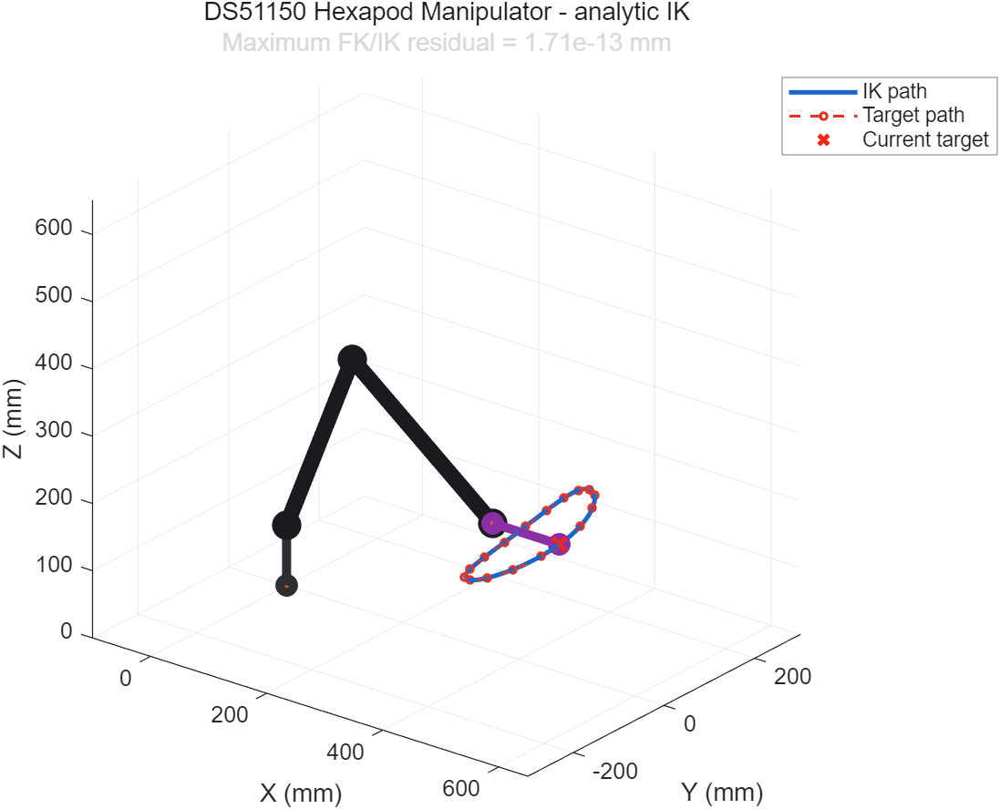
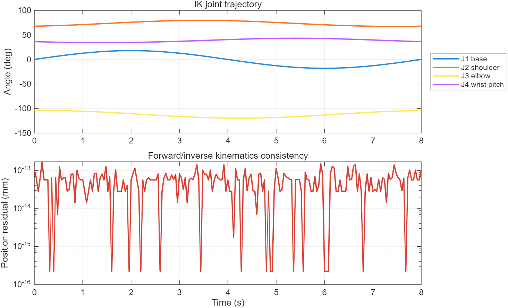

# DS51150 매니퓰레이터 MATLAB 역기구학 시뮬레이션

Arduino Uno로 제어하는 6축 매니퓰레이터의 기구학을 MATLAB에서 검증한다. J1 베이스 회전과 J2·J3 평면 2링크 위치 역기구학을 해석적으로 계산하고, J4가 지정한 말단 Pitch를 유지하도록 보정한다. J5 손목 Roll과 J6 그리퍼는 위치 역기구학에 영향을 주지 않는 독립축으로 둔다.

Robotics System Toolbox 없이 기본 MATLAB만으로 실행할 수 있다. 계산된 관절각은 실제 Arduino 코드와 같은 영점 펄스, 서보 방향 및 각도당 펄스 설정을 사용하여 PWM 값으로 변환한다.





## 모델 구성

| 관절 | 기능 | 구동기 |
|---|---|---|
| J1 | 베이스 Yaw | DS51150-270 |
| J2 | 어깨 Pitch | DS51150-270 |
| J3 | 팔꿈치 Pitch | DS51150-270 |
| J4 | 손목 Pitch 및 말단 자세 유지 | DS51150-270 |
| J5 | 손목 Roll | SPT5435LV-180 |
| J6 | 그리퍼 개폐 | SPT5435LV-180 |

좌표계는 X-Y 평면을 수평면, Z축을 위쪽으로 정의한다. J2는 수평면 기준 어깨각이며 말단 Pitch는 `J2 + J3 + J4`다. 해석해는 Arduino 제어기의 접힌 팔꿈치와 대응하도록 `-acos` 가지를 사용한다.

목표점 `(x,y,z)`와 말단 Pitch `phi`로부터 J1은 `atan2(y,x)`로 계산한다. 말단 오프셋을 제거한 손목 중심 `(rw,zw)`에 대해 다음 2링크 해석해를 적용한다.

```text
D  = (rw^2 + zw^2 - L1^2 - L2^2) / (2 L1 L2)
J3 = -acos(D)
J2 = atan2(zw,rw) - atan2(L2 sin(J3), L1 + L2 cos(J3))
J4 = phi - J2 - J3
```

현재 Arduino 코드와 일치시키기 위해 `L1=300 mm`, `L2=300 mm`를 사용했다. 이 두 값은 아직 CAD 축간거리로 검증되지 않은 임시값이다. 말단 오프셋은 `115 mm`, 베이스 높이는 시각화를 위한 `90 mm`로 분리했다. 실제 설계값을 측정한 뒤 `manipulator_parameters.m`만 수정하면 전체 시뮬레이션에 반영된다.

## 실행 방법

MATLAB Current Folder를 이 폴더로 이동한 뒤 다음을 실행한다.

```matlab
run_manipulator_ik
```

애니메이션 없이 계산과 결과 파일만 생성하려면 다음을 실행한다.

```matlab
results = run_manipulator_ik("Animate", false);
```

전체 자체 검증은 다음 명령으로 실행한다.

```matlab
validate_manipulator_ik
```

## 생성 결과

`run_manipulator_ik`는 8초 동안 부드러운 3차원 폐곡선 목표를 추종한다. 모든 표본에서 도달 가능성과 관절 제한을 검사하고, 정기구학으로 위치를 다시 계산하여 역기구학 잔차를 측정한다.

MATLAB R2025b에서 201개 표본을 검증했으며 전 표본이 도달 가능 범위와 설정된 관절 제한을 만족했다. 최대 IK-FK 위치 잔차는 `1.71e-13 mm`로 부동소수점 계산 오차 수준이었다.

- `results/ik_trajectory.png`: 목표 궤적, IK 도달 궤적 및 최종 자세
- `results/joint_angles_and_error.png`: J1~J4 각도와 FK/IK 위치 잔차
- `results/ik_results.csv`: 시간별 목표·도달 좌표, 관절각, J1~J6 PWM

MATLAB 결과는 기구학 및 소프트웨어 계산 검증이다. 서보 백래시, 링크 탄성, 하중에 따른 처짐, 조립 오차, PWM 비선형성 및 충돌은 포함하지 않는다. 따라서 실제 로봇 정확도 검증을 주장하지 않으며, 실기 적용 전 CAD 축간거리와 관절 제한을 반드시 교체해야 한다.
